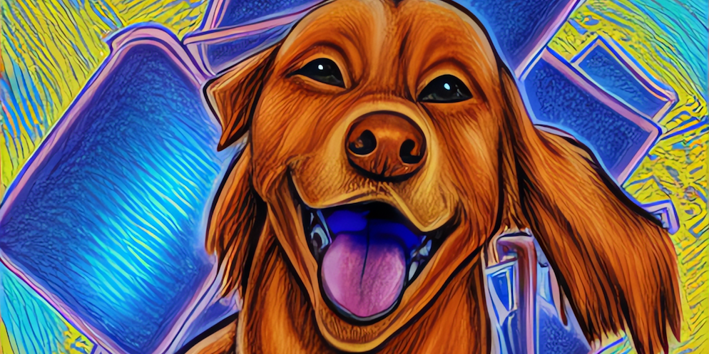

<p align="center">
  
</p>
<h1 align="center">
rusty-lassie
</h1>

> A Rust wrapper for Lassie - a minimal universal retrieval client library for
> IPFS and Filecoin

Lassie repository: https://github.com/filecoin-project/lassie

## Installation

```shell
$ cargo add lassie
```

This library uses CGo to turn the Go version of Lassie into a library we can
link to Rust programs.

In addition to the Rust build toolchain, you also need Go installed. See
[Go Downloads](https://go.dev/dl/).

On Windows, Go uses `gcc` to create C libraries. Go recommends installing
[TDM GCC](https://jmeubank.github.io/tdm-gcc/).

## Basic Use

We are using Lassie in a daemon mode. We run the Lassie HTTP server in the
background and then use an HTTP client like
[ureq](https://crates.io/crates/ureq) to fetch content from IPFS & Filecoin
networks using Lassie's HTTP interface.

The first step is to start the Lassie daemon:

```rs
use lassie::Daemon;

pub fn main() {
  let daemon = Daemon::start(DaemonConfig::default()).expect("cannot start Lassie");
  let port = daemon.port();

  // ...
}
```

Notes:

- You don't need to stop the daemon, it will be stopped when it's dropped.

- There can be only one daemon running per process, the library enforces this.

- This code is synchronous and uses `Mutex` under the hood. Be mindful of the
  ramifications when starting the daemon from `async fn`!

Once the daemon is running, you can make HTTP requests to fetch content.

```rs
let port = daemon.port();
let url = format!("http://127.0.0.1:{port}/ipfs/bafybeib36krhffuh3cupjml4re2wfxldredkir5wti3dttulyemre7xkni");
let response = ureq::get(&url)
    .set("Accept", "application/vnd.ipld.car")
    .call();

let mut content = Vec::new();
response
    .into_reader()
    .read_to_end(&mut content)
    .expect("cannot read response body");

// content contains raw CAR data
```

Learn more about Lassie in their documentation:

- [HTTP API Specification](https://github.com/filecoin-project/lassie/blob/main/docs/HTTP_SPEC.md)
- [Returned CAR Specification](https://github.com/filecoin-project/lassie/blob/main/docs/CAR.md)

## Windows specifics

It's not possible to statically link a library produced by CGo to a Rust program
compiled using MSVC toolchain. As a workaround, we are building the Go Lassie
library as a DLL that must be distributed together with the application
executable.

Rusty-Lassie's build script copies the DLL into the target directory next to the
main executable. All you need is to include this DLL in your distribution
archive.

## Cross-compilation

If you are building your project using
[Cross](https://github.com/cross-rs/cross), you need to install Go in the Docker
images used by Cross.

For example, you can add a `Cross.toml` file with the following content to your
project root (replace the Go version as needed):

```toml
[target.x86_64-unknown-linux-gnu]
pre-build = [
  "rm -rf /usr/local/go && curl -L https://go.dev/dl/go1.20.5.linux-amd64.tar.gz | tar -xz -C /usr/local && ln -s /usr/local/go/bin/go /usr/local/bin/ && go version"
]

[target.aarch64-unknown-linux-gnu]
pre-build = [
  "rm -rf /usr/local/go && curl -L https://go.dev/dl/go1.20.5.linux-arm64.tar.gz | tar -xz -C /usr/local && ln -s /usr/local/go/bin/go /usr/local/bin/ && go version"
]
```

Learn more in Cross and Go documentation:

- [Configuring cross via a Cross.toml file](https://github.com/cross-rs/cross#option-2-configuring-cross-via-a-crosstoml-file)
- [Pre-build hook](https://github.com/cross-rs/cross#pre-build-hook)
- [Download and install Go](https://go.dev/doc/install)

## License

This library is dual-licensed under Apache 2.0 and MIT terms.

Copyright 2023. Protocol Labs, Inc.
